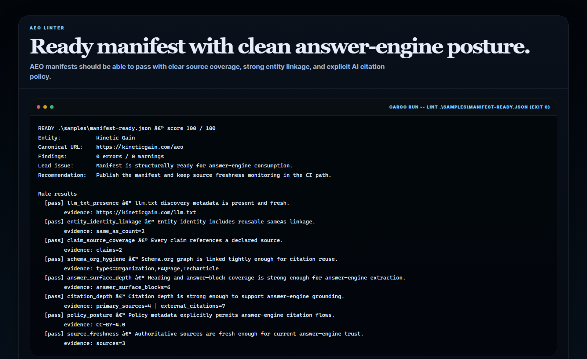
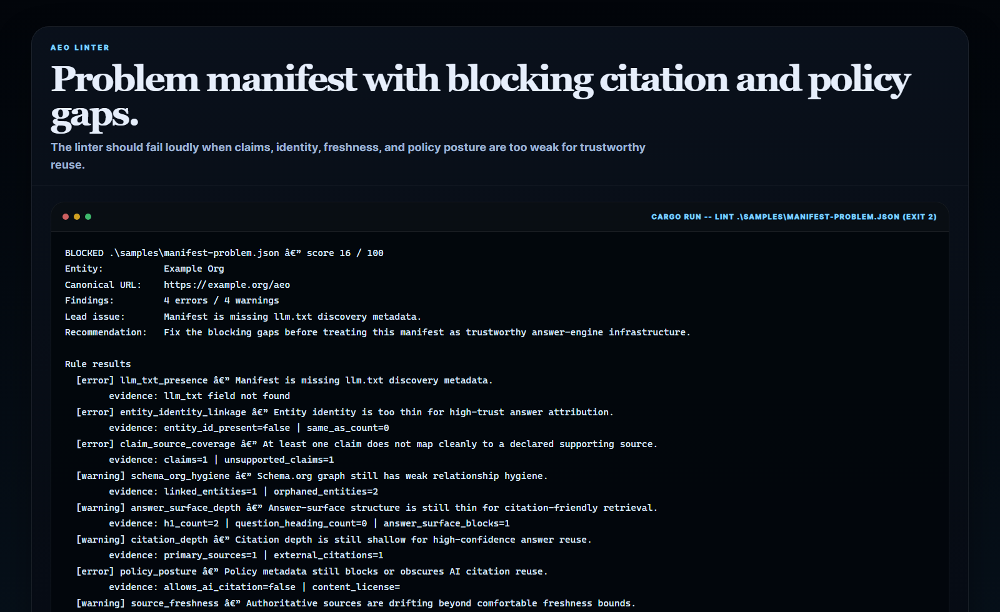
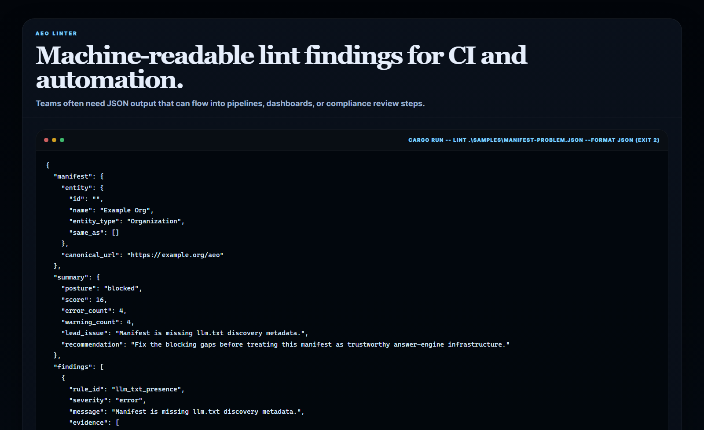
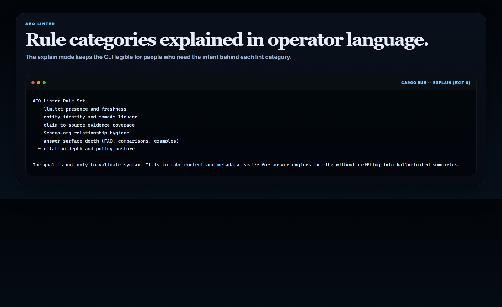
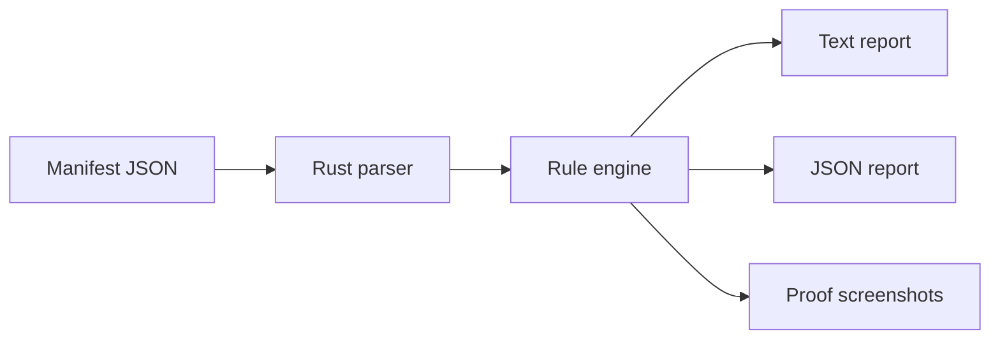

# AEO Linter

Rust CLI for **validating AEO manifests, entity-link quality, schema hygiene, answer-surface depth, and citation readiness**.

> **What this repo proves**
>
> AEO infrastructure gets much more trustworthy when manifests are linted for retrieval quality, source coverage, and policy posture before they get published.

## Why this repo exists

Most AEO documents can be syntactically valid while still being weak for real
answer-engine use:

- `llm.txt` is present but stale
- entity identity is too thin for confident citation
- claims do not map cleanly to declared sources
- Schema.org entities are partially orphaned
- answer blocks are too shallow to support extraction
- policy metadata is ambiguous about AI citation

`aeo-linter` focuses on those gaps directly. It is a narrower tool than a full
SDK or crawler: it exists to tell you whether a manifest is truly ready to
support citation-friendly retrieval.

## Screenshots

### Ready Manifest



### Problem Manifest



### JSON Findings



### Rule Set



## What it includes

- Rust CLI built with `clap`
- manifest linting for:
  - `llm.txt` freshness
  - entity linkage quality
  - claim-to-source coverage
  - Schema.org relationship hygiene
  - answer-surface depth
  - citation depth
  - policy posture
  - authoritative source freshness
- text and JSON output modes
- sample ready and problem manifests
- real screenshot proof generated from command output
- docs, changelog, tests, and CI

## Local run

```powershell
cd aeo-linter
$env:Path = "$env:USERPROFILE\.cargo\bin;$env:Path"
cargo run -- lint .\samples\manifest-ready.json
```

Also try:

```powershell
cargo run -- lint .\samples\manifest-problem.json
cargo run -- lint .\samples\manifest-ready.json --format json
cargo run -- explain
```

## Validation

```powershell
cd aeo-linter
$env:Path = "$env:USERPROFILE\.cargo\bin;$env:Path"
cargo test
cargo build
py -3.11 .\scripts\generate_screenshots.py
```

## Example text output

```text
READY samples\manifest-ready.json — score 100 / 100
Entity:           Kinetic Gain
Canonical URL:    https://kineticgain.com/aeo
Findings:         0 errors / 0 warnings
```

## Example JSON output

```json
{
  "summary": {
    "posture": "blocked",
    "score": 34
  }
}
```

## Architecture



More detail lives in [docs/architecture.md](./docs/architecture.md).
